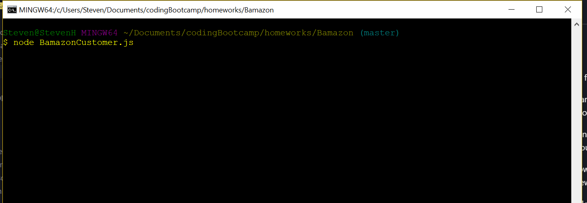
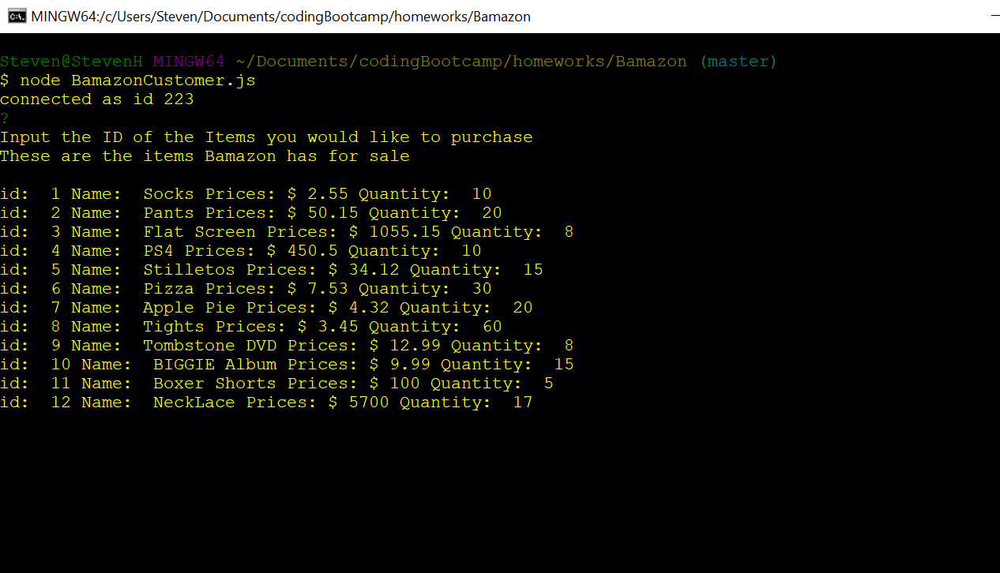
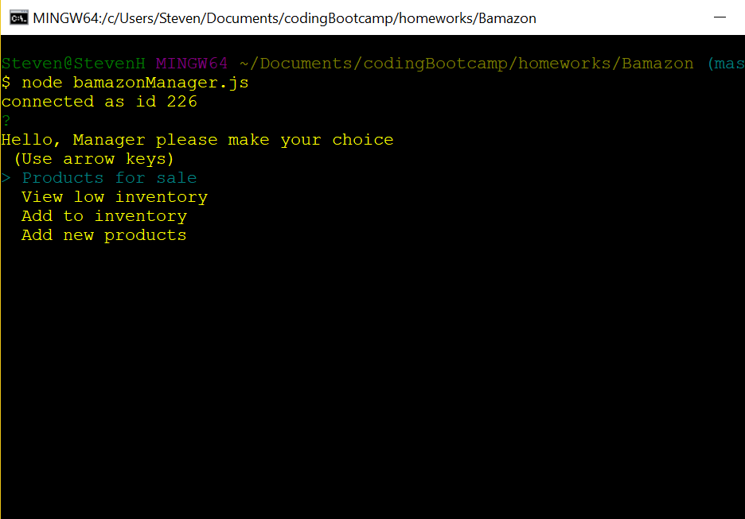
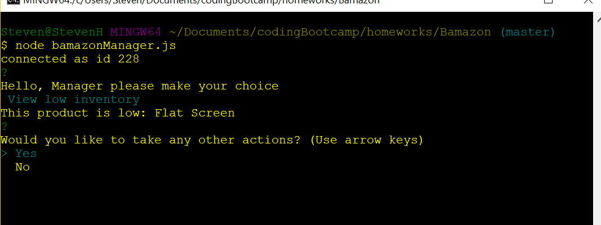
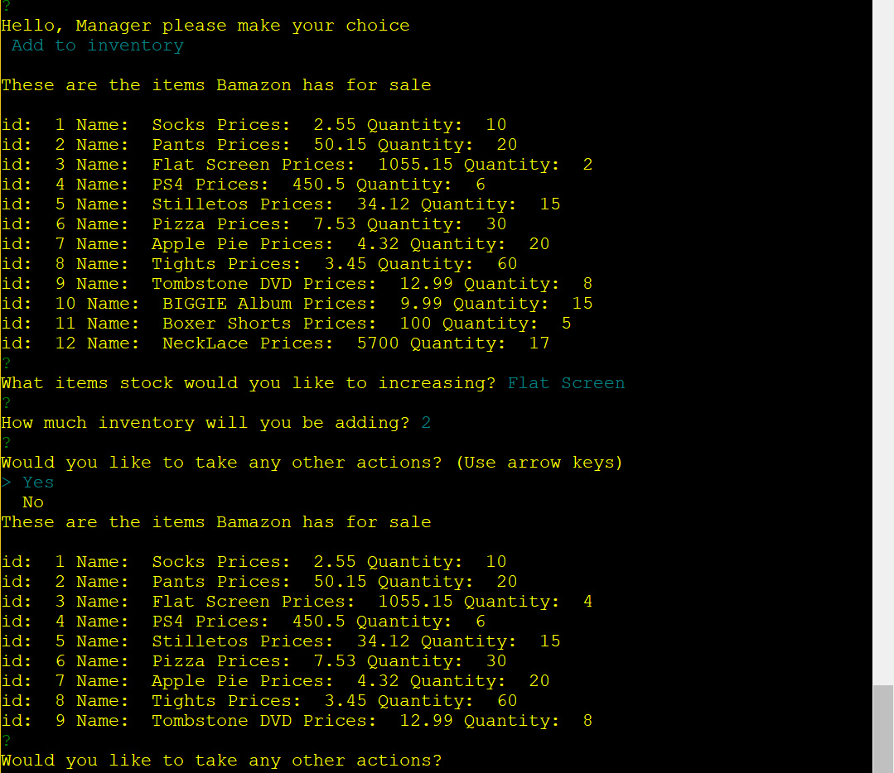
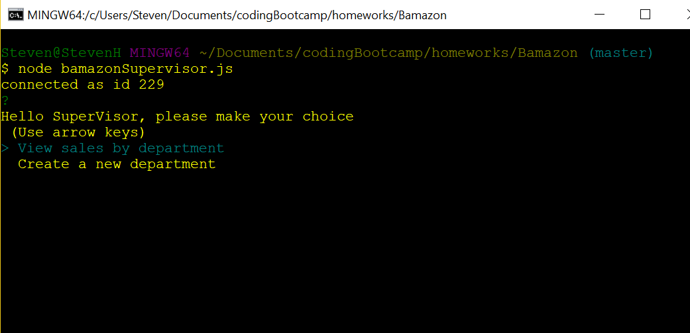
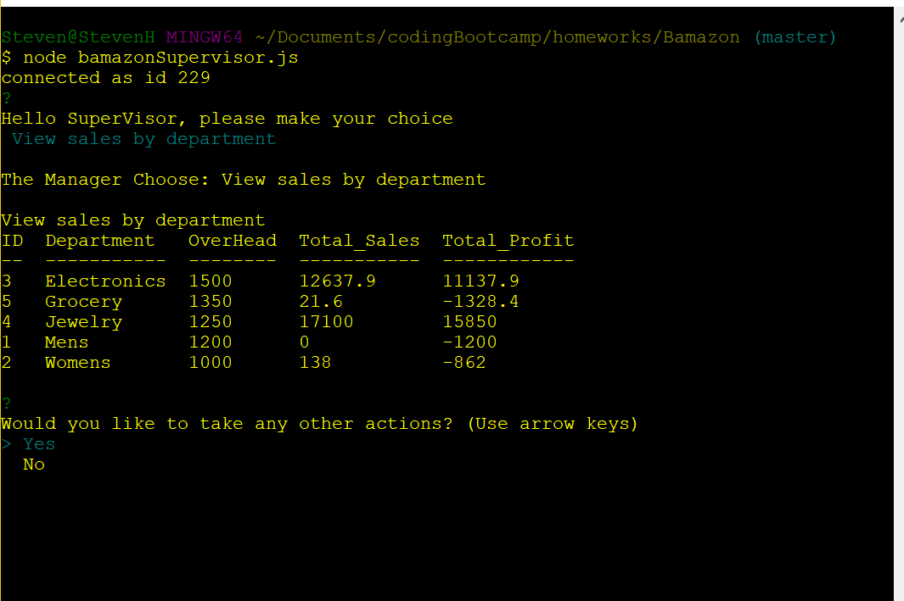

## Bamazon

**author:**  
 Steven Henke

This is a Command Line Application for a fake store called Bamazon.

Depending on the file you choose, you can either act as a Customer of Baamazon,  the Manager of Bamazon or the Supervisor of Bamazon.

Running the BamazonCustomer.js will print out the inventory, and allow you to make a choice of product and quantity you would like to by.

Running the bamazonManager.js will allow you to View the Inventory, Add New Inventory, Increase Inventory and Add New Products.

Running the BamazonSupervisor.js will allow you to View Department Sales, with a table the outputs Total Profits for that department.  The BamazonSupervisor.js file will also allow you to add new departments.

Please see the attached Video for a demonstration.

https://drive.google.com/file/d/1mYBilCvqNI2CdlKPtinO8EZYGvKekwGl/view

